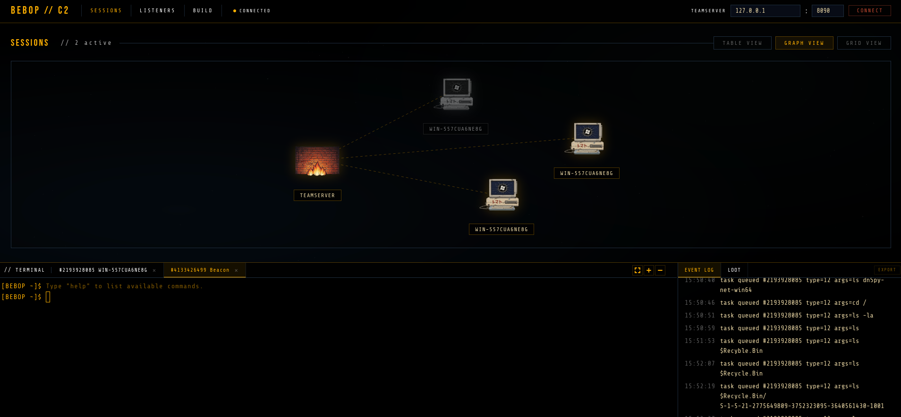
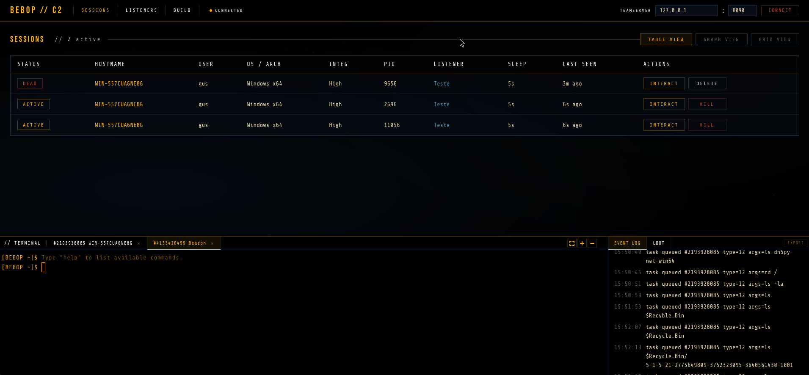

<p align="center">
  
</p>

<p align="center">
  
  
  
  
  
</p>

---

Asynchronous C2 framework for red team operations. Go teamserver, C beacons for Windows and Linux, browser-based operator console.

<p align="center">
  
</p>

<p align="center">
  
</p>

The Windows beacon is native Win32 with no CRT API dependencies in the IAT. All Windows APIs are resolved at runtime through PEB walking and DJB2 hashing. The Linux beacon is a statically-linked ELF using mbedTLS for crypto. Communication is binary-over-HTTP with AES-256-CBC + HMAC-SHA256 using derived sub-keys (HKDF). The operator console gives you terminals, file browsers, session maps, and an event log from any browser.

## How it works

```
         OPERATOR NETWORK                              TARGET NETWORK
  ┌─────────────────────────────────┐           ┌─────────────────────────┐
  │                                 │           │                         │
  │  ┌──────────┐   ┌────────────┐ │  HTTP/S   │  ┌─────────┐           │
  │  │ Operator │──>│ Teamserver │─┼──── // ────┼─>│ Beacon  │──[WinAPI] │
  │  │ Browser  │   └──────┬─────┘ │   TCP     │  ├─────────┤           │
  │  └──────────┘          │       │──── // ────┼─>│ Beacon  │──[Linux]  │
  │                   ┌────┴─────┐ │           │  └─────────┘           │
  │                   │ Builder  │ │           │                         │
  │                   │MinGW/musl│ │           │                         │
  │                   └──────────┘ │           │                         │
  └─────────────────────────────────┘           └─────────────────────────┘

  Registration:  Beacon ──[RSA-OAEP(session_key + metadata)]──> Teamserver
  Checkin loop:  Beacon ──[beacon_id]──> Teamserver ──[AES(task)]──> Beacon
  Results:       Beacon ──[AES(output)]──> Teamserver
  Sleep:         Beacon sleeps with jitter between checkins
```

## Architecture

### Teamserver (Go)

Single binary, no external dependencies. Manages beacon state, queues tasks, serves the operator UI, and cross-compiles beacons on the fly via MinGW (Windows) or musl-gcc (Linux).

- Asynchronous task queue per beacon
- SQLite persistent store with session restore on startup (load previous session or reset)
- Multi-operator authentication (bcrypt + JWT) with token revocation
- Real-time operator chat via WebSocket (rate-limited, persisted in SQLite)
- Interactive session mode — persistent TCP connections for low-latency commands
- SOCKS5 proxy pivoting through beacon (auto-assigned ports 1080-1099)
- WebSocket hub for real-time event broadcasting to all connected operators
- RSA keypair generated at startup, kept in memory
- Multiple listeners on different ports and protocols
- On-demand beacon compilation with per-build string obfuscation
- HKDF domain separation for AES and HMAC sub-keys
- Execute-assembly pipeline with Donut shellcode and sacrificial process

### Beacon — Windows (C / Win32)

Lightweight implant for Windows x64. Communicates over WinHTTP, uses Windows CNG for crypto.

- All Windows APIs resolved via PEB walk + DJB2 hash (zero suspicious IAT entries)
- Anonymous pipes capture output from spawned processes
- 20+ native commands (ls, ps, whoami, netstat, ipconfig, arp, drives, services, privs, env, clipboard, reg_query, reg_set, runas) via WinAPI, no `cmd.exe` unless explicitly requested
- Execute-assembly: in-memory .NET execution via Donut shellcode + sacrificial MSBuild.exe process
- Interactive session mode — upgrades to persistent TCP for real-time shell I/O
- SOCKS5 relay with channel-based bidirectional tunneling (up to 64 concurrent channels)
- Integrity-level detection (Medium / High / SYSTEM) reported on registration
- File transfer with chunked 64KB streaming (upload and download)

### Beacon — Linux (C / ELF)

Statically-linked ELF implant. Uses mbedTLS for crypto, no external dependencies at runtime.

- 24 native builtins (ls, ps, cat, chmod, curl, portscan, ssh, triagedirectory, and more)
- AES-256-CBC + HMAC-SHA256 via mbedTLS with constant-time HMAC verification
- Interactive session mode with persistent TCP connection
- SOCKS5 proxy relay with multi-channel tunneling
- File transfer with chunked 64KB streaming (upload and download)
- XOR string obfuscation (same pipeline as Windows, fresh key per build)
- Supports x86_64 and aarch64 targets

### Operator console (web)

Browser-based UI with a terminal-centric workflow. Modular vanilla JS served by the operator-client binary. No build step.

- JWT-authenticated login page
- Tabbed terminals with persistent command history and output across tab switches
- File browser with tree view, context menu operations (cat, download, upload, mkdir, delete, copy path)
- Event log with operator-attributed timestamped entries
- Real-time operator chat panel via WebSocket
- Session map as a force-directed graph with zoom/pan, plus table view
- Right-click context menus and double-click to interact with beacons, sessions, and listeners
- Terminal fullscreen mode
- Resizable panels between terminal and event log
- Loot tab for exfiltrated file management (download, delete)
- Toast notifications on new beacon callbacks

## Evasion

### API hashing

Windows API functions are resolved at runtime through DJB2 hashing and PEB walking. The IAT contains only MinGW CRT functions (memcpy, strlen, etc.). Nothing from WinHTTP, BCrypt, Advapi32, User32, or kernel32 that reveals beacon behavior. The hash table is generated at build time by the teamserver.

### String obfuscation

All hardcoded strings (API paths, hostnames, command names, User-Agent, DLL names) are encrypted with an 8-byte rotating XOR key at compile time. Decrypted in memory just before use. The obfuscation generator runs as part of the build pipeline so each compiled beacon gets a fresh key. Applied to both Windows and Linux beacons.

DLL names passed to LoadLibraryA (winhttp.dll, bcrypt.dll, advapi32.dll, etc.) are also XOR-encrypted and decrypted on the stack at runtime. No DLL names appear as plaintext in the binary.

### Shellcode generation

.bin payloads via Donut. Position-independent shellcode for direct memory injection without writing to disk.

### Traffic

AES-256-CBC + HMAC-SHA256 (encrypt-then-MAC) with HKDF domain separation (separate sub-keys for encryption and authentication). Session keys are established through RSA-OAEP during registration. Jitter (0-100%) and configurable sleep intervals break periodic beacon patterns.

## Protocol

All beacon-to-teamserver traffic uses a custom binary protocol over HTTP, based on the [OST C2 Spec](https://github.com/rasta-mouse/OST-C2-Spec).

```
Task header (16 bytes, little-endian):
  [0]     Type       uint8    NOP=0, Exit=1, Set=2, FileStage=3, FileExfil=4, Run=12
  [1]     Code       uint8    subtype
  [2:4]   Flags      uint16   0=ok, 1=error, 4=fragmented, 8=last
  [4:8]   Label      uint32   correlates request/response
  [8:12]  Identifier uint32   fragment ordering
  [12:16] Length     uint32   payload size

Wire format:
  [0:16]  IV              16 bytes, random per message
  [16:48] HMAC-SHA256     over IV + ciphertext (derived HMAC key)
  [48:]   AES-CBC         ciphertext (derived AES key)
```

Registration uses RSA-OAEP to deliver the beacon's session key and metadata. After that, everything is AES-CBC.

## Setup

### Teamserver

```bash
chmod +x setup-teamserver.sh
./setup-teamserver.sh
```

### Operator console

```bash
chmod +x setup-operator.sh
./setup-operator.sh
```

The beacon is compiled on demand from the operator console's Build page. Select the platform (Windows or Linux), listener, sleep interval, jitter, and output format (EXE, shellcode, or ELF). No manual beacon build needed.

## Project layout

```
teamserver/
  server/              HTTP handlers, routing, listeners, WebSocket hub
    session_listener   TCP session mode handler
    shell_handler      Interactive shell connection manager
    socks              SOCKS5 proxy relay manager
    ws_operator        Operator WebSocket with chat + event broadcasting
    hub                WebSocket connection hub
  store/               SQLite-backed persistent store (tasks, results, chat)
  auth/                Operator authentication (bcrypt, JWT, token revocation)
  models/              Beacon, Task, Result, Listener, Event, Terminal, Chat types
  protocol/            Binary serialization + crypto (HKDF key derivation)
  obfgen/              Build-time XOR string obfuscation
  hashgen/             DJB2 API hash generator
  builder/             Cross-compilation pipeline (MinGW + musl-gcc)
  persist/             JSON state persistence (listeners, beacons, loot)
  ui/                  Terminal UI helpers

beacon/                Windows x64 implant (Win32 / CNG)
  src/
    main.c             Entry point, checkin loop
    comms/
      http.c           WinHTTP communication
      session.c        Persistent TCP session mode
      shell.c          Interactive shell over TCP
      socks.c          SOCKS5 relay channels
    protocol/          AES-CBC + HMAC-SHA256 via CNG, HKDF sub-keys
    exec/              Process execution + native commands + execute-assembly
    resolve/           PEB walking + DJB2 hash resolution (~100 APIs)
    transfer/          File upload/download with 64KB chunked streaming
  include/             Headers, config, generated hash tables, XOR strings

beacon-linux/          Linux ELF implant (mbedTLS)
  src/
    main.c             Entry point, checkin loop
    comms/
      http.c           HTTP communication
      session.c        Persistent TCP session mode
      socks.c          SOCKS5 relay channels
    protocol/          AES-CBC + HMAC-SHA256 via mbedTLS
    exec/              Native builtins (24 commands)
    transfer/          File upload/download with 64KB chunked streaming
    util/              XOR string decryption
  include/             Headers, config, generated XOR strings

operator-client/
  static/
    pages/             HTML (sessions, listeners, build, login)
    css/               Stylesheets
    js/app/            Modular JS (core, views, terminal, filebrowser, websocket)
    js/                xterm.js terminal emulator
    img/               Assets
```

## Roadmap

### Done
- [x] Multiple HTTP/HTTPS listeners with auto-cert and custom headers
- [x] API hashing via PEB walk + DJB2 (~100 APIs, zero in IAT)
- [x] XOR string obfuscation (commands, paths, User-Agent, DLL names)
- [x] Shellcode generation via Donut
- [x] Native Win32 recon commands (20+ builtins)
- [x] Session map, tabbed terminals, event log
- [x] File transfer (upload/download with 64KB chunked streaming)
- [x] HKDF domain separation for AES and HMAC sub-keys
- [x] Full IAT cleanup (all beacon APIs resolved dynamically)
- [x] Interactive session mode (real-time TCP shell)
- [x] SOCKS5 proxy pivoting through beacon
- [x] SQLite persistent store (replace JSON)
- [x] Multi-operator authentication (bcrypt + JWT + token revocation)
- [x] Real-time operator chat via WebSocket
- [x] WebSocket-based operator communication for live UI updates
- [x] Operator management CLI (add, delete, list)
- [x] Linux beacon (ELF, mbedTLS, 24 native builtins, session mode, SOCKS5)
- [x] Execute-assembly for .NET tooling (Donut + sacrificial MSBuild.exe)
- [x] File browser with tree view and context menu operations
- [x] Operator-attributed event logging

### Next
- [ ] Ekko sleep masking (RC4 image encryption, VirtualProtect RW/RX toggle)
- [ ] Direct syscalls to bypass EDR hooks (SysWhispers-style)
- [ ] BOF loader for in-memory Beacon Object Files
- [ ] Malleable C2 profiles (configurable HTTP headers, URIs, body encoding)
- [ ] Beacon staging (minimal stager that downloads full beacon)

### Later
- [ ] ETW patching (EtwEventWrite in-memory patch)
- [ ] AMSI bypass (AmsiScanBuffer patch)
- [ ] DNS and SMB transport channels
- [ ] Token manipulation for lateral movement
- [ ] Screenshot and keylogger tasking

---

## Disclaimer

For educational and authorized security testing only. You are responsible for how you use this software.

---

<p align="center">
  <i>"See you space cowboy..."</i>
</p>
