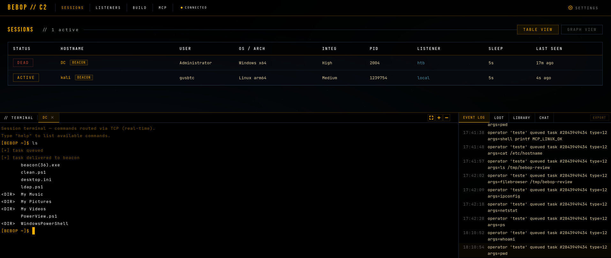
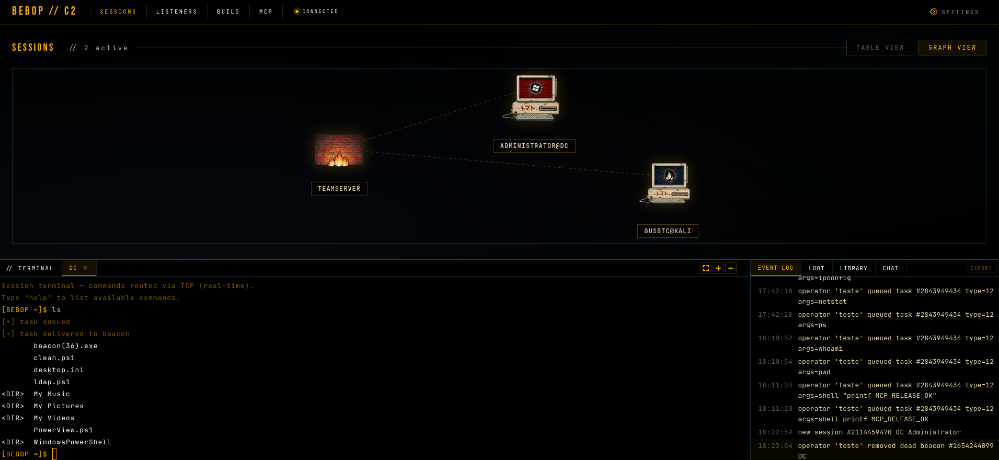

<p align="center">
  
</p>

<p align="center">
  
  
  
  <a href="https://gusbtc.github.io/docs/intro"></a>
  
</p>

---

Bebop C2 is an asynchronous command-and-control framework for authorized red team operations, security research, and lab training.

Bebop combines a Go teamserver, Windows and Linux C beacons, a browser operator console, BOF execution, in-process .NET execution, native file operations, SOCKS pivoting, interactive sessions, and an HTTP MCP interface for structured automation.

Key features:

- Windows and Linux beacon generation from the teamserver.
- BOF loader with built-in and operator-uploaded object libraries.
- Inline assembly path for memory-resident .NET tooling on Windows.
- Interactive session mode, SOCKS5 pivoting, loot tracking, and cached file browser state.
- Operator-bound MCP tokens with typed tools for sessions, tasking, files, BOFs, and assemblies.

Full documentation:

[https://gusbtc.github.io/docs/intro](https://gusbtc.github.io/docs/intro)

## Screenshots

<p align="center">
  
</p>

<p align="center">
  
</p>

## Quick Start

Run both setup scripts from the repository root.

### Teamserver

```bash
chmod +x setup-teamserver.sh
./setup-teamserver.sh --host 127.0.0.1 --port 8080 --session-port 4443
```

Useful flags:

- `--host <ip|name>`: host/IP embedded in generated beacons.
- `--port <port>`: teamserver HTTP/API port.
- `--session-port <port>`: interactive/session-mode TCP port.
- `--no-start`: install dependencies and build without starting.
- `--skip-deps`: skip dependency installation.

### Operator Client

```bash
chmod +x setup-operator.sh
./setup-operator.sh --host 127.0.0.1 --port 9090
```

Useful flags:

- `--host <ip|name>`: operator web UI bind host.
- `--port <port>`: operator web UI port.
- `--no-start`: install dependencies and build without starting.
- `--skip-deps`: skip dependency installation.

Open the operator client in a browser, log in, then select or enter the teamserver URL from the frontend.

## Manual Build

```bash
cd teamserver && go build -o ../bin/teamserver .
cd ../operator-client && go build -o ../bin/operator-client .
```

Run manually:

```bash
./bin/teamserver -host 127.0.0.1 -port 8080 -session-port 4443
./bin/operator-client -host 127.0.0.1 -port 9090
```

## Documentation

Use the documentation site for installation details, architecture, beacon commands, BOF execution, inline assembly, MCP setup, operator workflows, and troubleshooting:

[https://gusbtc.github.io/docs/intro](https://gusbtc.github.io/docs/intro)

## License

MIT
